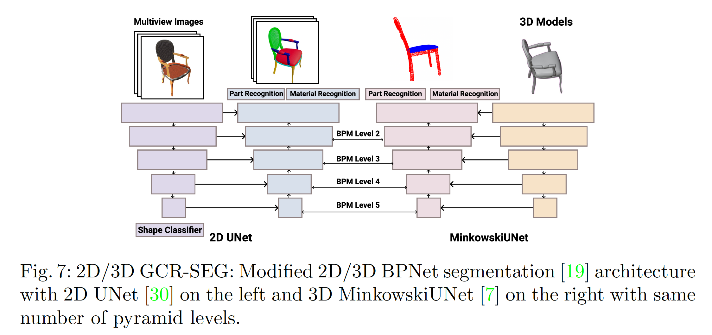

# This folder includes the code for the 2D/3D *Grounded CoMPaT Recognition (GCR)* Task.



## 1. Environment
To run BPNet successfully, please follow the setting on this environment
```shell
# Torch
$ pip install torch==1.4.0+cu100 torchvision==0.5.0+cu100 -f https://download.pytorch.org/whl/torch_stable.html
# MinkowskiEngine 0.4.1
$ conda install numpy openblas
$ git clone https://github.com/StanfordVL/MinkowskiEngine.git
$ cd MinkowskiEngine
$ git checkout f1a419cc5792562a06df9e1da686b7ce8f3bb5ad
$ python setup.py install
# Others
$ pip install imageio==2.8.0 opencv-python==4.2.0.32 pillow==7.0.0 pyyaml==5.3 scipy==1.4.1 sharedarray==3.2.0 tensorboardx==2.0 tqdm==4.42.1
```

## 2. Data Preparation
- Please download the data associated with 3d compat by filling this form https://3dcompat-dataset.org/doc/dl-dataset.html. 

- Change the data_root in config file to your own path.
https://github.com/lx709/BPNet/blob/ae8a271016ac058c9b1cb0e3ed511a4e05928c04/config/compat/bpnet_10_coarse.yaml#L3

- For the efficiency of the datanet, we prvoide the point clouds generated from the 3dcompat models. Change the data directory accordingly. https://github.com/lx709/BPNet/blob/24de1967aa470b7d1affa961db7b179bb3d1faac/dataset/GCR_loader.py#L412.

- Download pretrained 2D ResNets on ImageNet from PyTorch website, and put them into the initmodel folder.
```
model_urls = {
    'resnet18': 'https://download.pytorch.org/models/resnet18-5c106cde.pth',
    'resnet34': 'https://download.pytorch.org/models/resnet34-333f7ec4.pth',
    'resnet50': 'https://download.pytorch.org/models/resnet50-19c8e357.pth',
    'resnet101': 'https://download.pytorch.org/models/resnet101-5d3b4d8f.pth',
    'resnet152': 'https://download.pytorch.org/models/resnet152-b121ed2d.pth',
}
```


## 3. GCR using BPNet

### 3.1 Config
- BPNet with 10 Compositions: ```config/compat/bpnet_10_[coarse/fine].yaml``` 

### 3.2 Training

- Start training:
```sh tool/train.sh EXP_NAME /PATH/TO/CONFIG NUMBER_OF_THREADS```

- Resume: 
```sh tool/resume.sh EXP_NAME /PATH/TO/CONFIG(copied one) NUMBER_OF_THREADS```

NUMBER_OF_THREADS is the threads to use per process (gpu), so optimally, it should be **Total_threads / gpu_number_used**


For Example, we train 10 compositions with:

```sh tool/train.sh com10_coarse config/compat/bpnet_10_coarse.yaml 12```

### 3.4 Test

For Example, we evaluate  10 compositions with:

```sh tool/test.sh com10_coarse config/compat/bpnet_10_coarse.yaml 12```

#### **Coarse-grained**
|                   | Accuracy | Value | Value All | Grounded Value | Grounded Value All | Pretrained Model |
|-------------------|----------|-------|-----------|----------------|--------------------|------------------|
| BPNet Coarse Valid| 74.69    | 62.98 | 47.1      | 55.77          | 38.11              | link             |
| BPNet Coarse Test | 76.1     | 65.21 | 51.05     | 58.4           | 42.54              | link             |


#### **Fine-grained**
|                   | Accuracy | Value | Value All | Grounded Value | Grounded Value All | Pretrained Model |
|-------------------|----------|-------|-----------|----------------|--------------------|------------------|
| BPNet Fine Valid| 74.69    | 62.98 | 47.1      | 55.77          | 38.11              | [link](https://drive.google.com/file/d/1J297W4CHfg_uMRpeFtTSxbu5bp4rIpTL/view?usp=sharing)             |
| BPNet Fine Test | 76.1     | 65.21 | 51.05     | 58.4           | 42.54              | same             |


## License
This code is released under MIT License (see LICENSE file for details). In simple words, if you copy/use parts of this code please keep the copyright note in place.


## Citation
If you find this work useful in your research, please consider citing:

```
@article{li20223dcompat,
    title={3D CoMPaT: Composition of Materials on Parts of 3D Things (ECCV 2022)},
    author={Yuchen Li, Ujjwal Upadhyay, Habib Slim, Ahmed Abdelreheem, Arpit Prajapati, Suhail Pothigara, Peter Wonka, Mohamed Elhoseiny},
    journal = {ECCV},
    year={2022}
}
```

```
@article{slim2023_3dcompatplus,
    title={3DCoMPaT++: An improved Large-scale 3D Vision Dataset
    for Compositional Recognition},
    author={Habib Slim, Xiang Li, Yuchen Li,
    Mahmoud Ahmed, Mohamed Ayman, Ujjwal Upadhyay
    Ahmed Abdelreheem, Arpit Prajapati,
    Suhail Pothigara, Peter Wonka, Mohamed Elhoseiny},
    year={2023}
}
```

```
@inproceedings{hu-2021-bidirectional,
        author      = {Wenbo Hu, Hengshuang Zhao, Li Jiang, Jiaya Jia and Tien-Tsin Wong},
        title       = {Bidirectional Projection Network for Cross Dimensional Scene Understanding},
        booktitle   = {CVPR},
        year        = {2021}
    }
```
